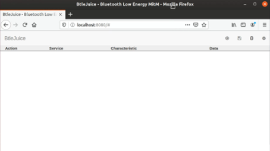
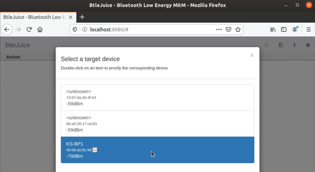
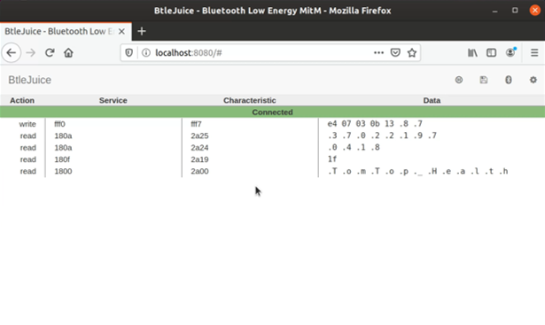


# BtleJuice
BtleJuice is a bluetooth framework created with the purpose of performing Man-In-The-Middle attacks on Bluetooth Low Energy devices.

## Setup
Ensure that you are using Node.js 8.10.0 along with npm. Then various dependencies are needed:

**Ubuntu/Debian/Raspbian**
```
sudo apt-get install bluetooth bluez libbluetooth-dev libudev-dev
```
**Fedora/Other-RPM based**
```
sudo yum install bluez bluez-libs bluez-libs-devel npm
```
The last step is to install btlejuice using npm:
```
sudo npm install -g btlejuice
```
If errors occur run this command to install the node-module separately:
```
sudo npm install bluetooth-hci-socket
```

## NVM and Node install
The first command installs the latest NVM version by running a script:
```
curl -o- https://raw.githubusercontent.com/nvm-sh/nvm/v0.35.2/install.sh | bash
```
You then restart the terminal and install the required node version:
```
nvm install 8.10.0
```
Once the version is installed ensure that it has been set as the default and if not set it:
```
nvm default alias 8.10.0
```
Then choose to use it:
```
nvm use 8.10.0
```

## Resolving node_modules error 
The error that occurred is "Error: Cannot find module '../build/Release/binding.node'"

The way to fix it is, firstly, removing the btlejuice dependencies:
```
sudo npm remove -g btlejuice
```

The next command reinstalls it by fixing the permissions:
```
sudo npm install -g btlejuice --unsafe-perm
```

## Running the tool
The tool requires a host machine containing a VM within. 

Once the virtual machine has btlejuice installed ensure the Bluetooth adapter is working on it:
```
$ sudo hciconfig

$ sudo hciconfig hci0 up
```

Make sure that the IP address is available to the host machine and use this command to find the IP address:
```
ifconfig
```

Start the proxy on the VM:
```
sudo btlejuice-proxy
```

On the host machine, the bluetooth service must be stopped and the HCI device should be open:
```
$ sudo service bluetooth stop
$ sudo hciconfig hci0 up
```

Now run this command on the host machine:
```
sudo btlejuice -u <Proxy IP address> -w
```

The output will show the Web Interface with the following link: http://localhost:8080


## Using the Web Interface

Once the web interface is open this is what is loaded:



**Selecting a target**
Once the Bluetooth button is selected, choose a target device from the list. Please note, you may have to wait for your device to appear or have to scroll lower to find it.



The dummy device will then be created and able to connect to the application. If the connection is successful the interface will state "Connected".




